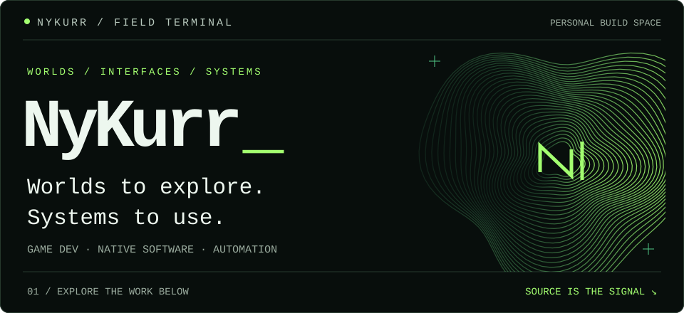
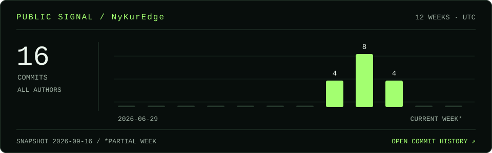

**I build games, desktop software, and the tools around them.**
My work moves between interactive worlds, native interfaces, and automation that makes software useful beyond the screen.

[Explore the code ↗](https://github.com/NyKurr/NyKurEdge) · [Public activity](https://github.com/NyKurr?tab=overview) · [Inside this profile](https://github.com/NyKurr/NyKurr/blob/main/MAINTENANCE.md)

## 01 / In the open

### [NyKur Edge ↗](https://github.com/NyKurr/NyKurEdge)
**A quieter interface at the edge of Windows.**

A native desktop companion for media, notifications, and ambient information. A transparent field and glass orb live at the display boundary; contextual controls appear when needed.

`C#` · `.NET` · `WinUI 3` · `Win2D` · `Windows APIs`

<b>Inspect the engineering</b> — rendering, integration, boundaries

- **Motion with structure.** Layered procedural filaments, spring-interpolated rendering, and live audio energy shape the ambient field.
- **Native integration.** Windows media sessions, notification listening, display anchoring, and packaged startup support.
- **A testable core.** State and policies are separated from Windows adapters and presentation, with deterministic core tests.
- **Local by design.** Settings stay on disk locally. Audio analysis and notification content stay in memory; no analytics or cloud account.

This is an initial vertical slice. The repository documents its implemented behavior and current limitations.

[Architecture](https://github.com/NyKurr/NyKurEdge/blob/main/docs/ARCHITECTURE.md) · [Current status](https://github.com/NyKurr/NyKurEdge/blob/main/docs/STATUS.md) · [Build it](https://github.com/NyKurr/NyKurEdge#build-and-run)

## 02 / Beyond the public tree

**Nyxterra** — my game-development work.

Alongside it, I work on tools, software projects, and automation/backend systems. Much of that work lives in private repositories; this profile keeps those projects at a high level.

## 03 / Signal history

A daily snapshot of commits in NyKurEdge, across all authors. This is project activity, not a measure of individual contributions. The dated image stays available if a refresh fails.

<b>Open the instrument panel</b>

The visual is generated here with Python and GitHub Actions. It reads public repository metadata and commit timestamps, then commits a small SVG back to this repository. No third-party stats host, tracking pixel, private contribution data, or personal access token is involved.

[Generator](https://github.com/NyKurr/NyKurr/blob/main/scripts/render.py) · [Snapshot](https://github.com/NyKurr/NyKurr/blob/main/data/signal.json) · [Refresh runs](https://github.com/NyKurr/NyKurr/actions/workflows/signal.yml)

---

**Start with the source.** Explore [NyKur Edge](https://github.com/NyKurr/NyKurEdge), or bring a reproducible bug or focused feature proposal to its [issue tracker](https://github.com/NyKurr/NyKurEdge/issues).

NYKURR / FIELD TERMINAL — built with intent, kept in plain sight.
